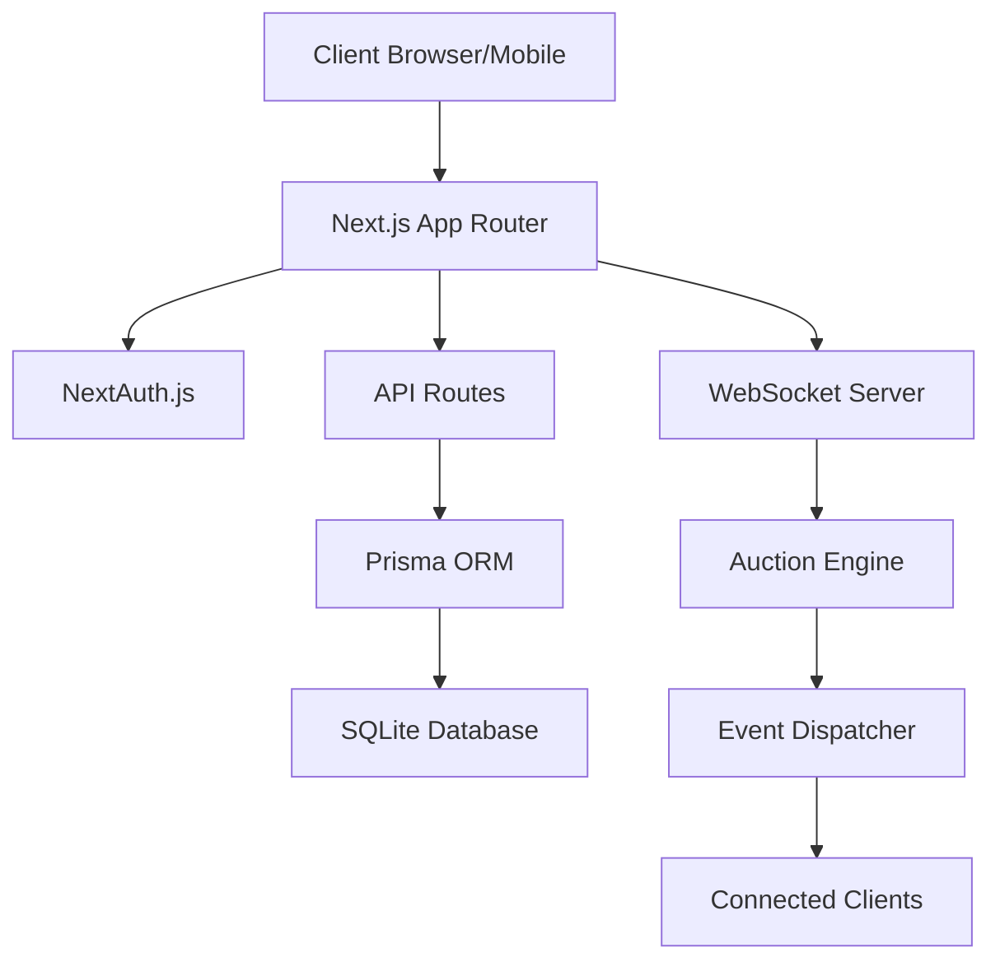
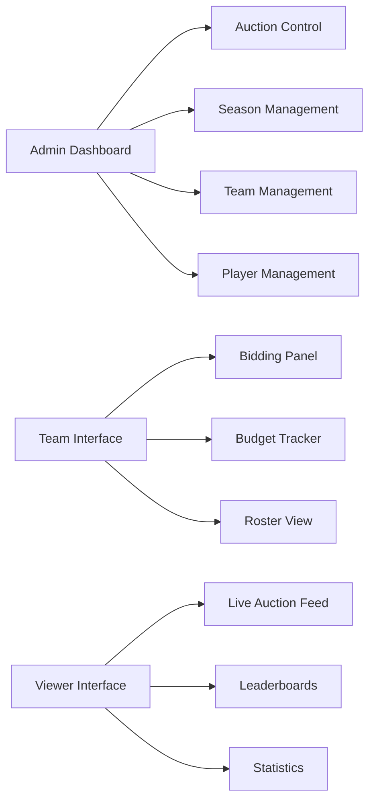
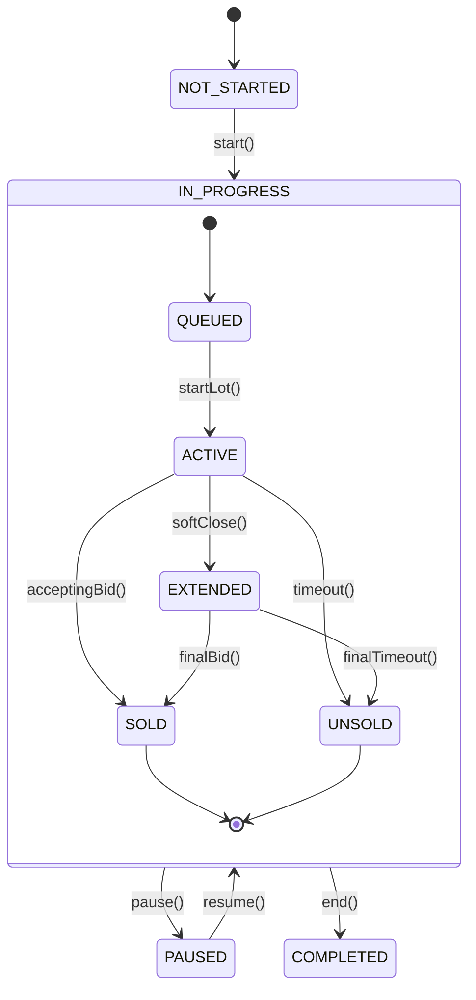

# IPL-Style Cricket Auction Application Design

## Overview

A real-time, mobile-first cricket player auction system optimized for live bidding with minimal latency and maximum efficiency. The system supports live ascending auctions with role-based access control and WebSocket-first architecture for coding agents and automated bidding.

### Key Features
- **Real-time bidding** with WebSocket communication
- **Role-based access control** (Admin, Team, Viewer)
- **Mobile-first responsive design** 
- **Batch operations** for minimal server requests
- **Agent-mode optimization** for automated bidding
- **Live auction engine** with configurable rules

## Technology Stack

| Component | Technology | Purpose |
|-----------|------------|---------|
| Frontend Framework | Next.js 14+ (App Router) | Server-side rendering, routing |
| Database | SQLite + Prisma ORM | Data persistence, type safety |
| Authentication | NextAuth.js | User management, session handling |
| Real-time Communication | WebSocket (ws library) | Live bidding updates |
| Styling | Tailwind CSS + Headless UI | Mobile-first responsive design |
| Validation | Zod | Input validation, type safety |
| State Management | Zustand (minimal client state) | Client-side state management |
| Deployment | Vercel/Docker | Development and production hosting |

## Architecture

### High-Level Architecture



### Component Architecture



## Data Models & Schema

### User Management

```prisma
model User {
  id           String    @id @default(cuid())
  email        String    @unique
  passwordHash String?
  name         String?
  role         UserRole  @default(VIEWER)
  teamId       String?
  team         Team?     @relation(fields: [teamId], references: [id])
  createdAt    DateTime  @default(now())
  updatedAt    DateTime  @updatedAt
}

enum UserRole {
  ADMIN
  TEAM
  VIEWER
}
```

### Season & Tournament Structure

```prisma
model Season {
  id          String       @id @default(cuid())
  name        String
  year        Int
  description String?
  status      SeasonStatus @default(DRAFT)
  startDate   DateTime?
  endDate     DateTime?
  settings    Json         // Auction rules, budgets, constraints
  teams       Team[]
  players     Player[]
  auctions    Auction[]
  createdAt   DateTime     @default(now())
  updatedAt   DateTime     @updatedAt
}

enum SeasonStatus {
  DRAFT
  ACTIVE
  ARCHIVED
}
```

### Team & Budget Management

```prisma
model Team {
  id           String      @id @default(cuid())
  name         String
  displayName  String?
  budgetTotal  Int
  budgetSpent  Int         @default(0)
  seasonId     String
  season       Season      @relation(fields: [seasonId], references: [id])
  ownerId      String?
  owner        User?       @relation(fields: [ownerId], references: [id])
  roster       Roster[]
  bids         Bid[]
  watchlist    Watchlist[]
  transactions BudgetTransaction[]
  createdAt    DateTime    @default(now())
  updatedAt    DateTime    @updatedAt
}

model BudgetTransaction {
  id          String    @id @default(cuid())
  teamId      String
  team        Team      @relation(fields: [teamId], references: [id])
  amount      Int       // Positive for credits, negative for debits
  type        TransactionType
  description String?
  lotId       String?   // If related to auction purchase
  createdAt   DateTime  @default(now())
}

enum TransactionType {
  INITIAL_BUDGET
  TOP_UP
  PENALTY
  PURCHASE
  REFUND
}
```

### Player & Auction Management

```prisma
model Player {
  id         String     @id @default(cuid())
  name       String
  country    String
  role       PlayerRole
  basePrice  Int
  seasonId   String
  season     Season     @relation(fields: [seasonId], references: [id])
  stats      Json?      // Player statistics
  tags       String?    // Comma-separated tags
  isOverseas Boolean    @default(false)
  lots       Lot[]
  roster     Roster[]
  watchlist  Watchlist[]
  createdAt  DateTime   @default(now())
  updatedAt  DateTime   @updatedAt
}

enum PlayerRole {
  BATSMAN
  BOWLER
  ALL_ROUNDER
  WICKET_KEEPER
}

model Auction {
  id            String        @id @default(cuid())
  name          String
  seasonId      String
  season        Season        @relation(fields: [seasonId], references: [id])
  status        AuctionStatus @default(NOT_STARTED)
  currentLotId  String?
  currentLot    Lot?          @relation("CurrentLot", fields: [currentLotId], references: [id])
  settings      Json          // Timer, increments, rules
  lots          Lot[]         @relation("AuctionLots")
  events        AuctionEvent[]
  createdAt     DateTime      @default(now())
  updatedAt     DateTime      @updatedAt
}

enum AuctionStatus {
  NOT_STARTED
  IN_PROGRESS
  PAUSED
  COMPLETED
}
```

### Bidding & Lot Management

```prisma
model Lot {
  id           String    @id @default(cuid())
  auctionId    String
  auction      Auction   @relation("AuctionLots", fields: [auctionId], references: [id])
  playerId     String
  player       Player    @relation(fields: [playerId], references: [id])
  status       LotStatus @default(QUEUED)
  currentPrice Int?
  soldToId     String?
  soldTo       Team?     @relation(fields: [soldToId], references: [id])
  finalPrice   Int?
  order        Int
  startedAt    DateTime?
  endsAt       DateTime?
  bids         Bid[]
  events       AuctionEvent[]
  currentAuction Auction[] @relation("CurrentLot")
  createdAt    DateTime  @default(now())
  updatedAt    DateTime  @updatedAt
}

enum LotStatus {
  QUEUED
  IN_PROGRESS
  SOLD
  UNSOLD
  PAUSED
}

model Bid {
  id        String   @id @default(cuid())
  lotId     String
  lot       Lot      @relation(fields: [lotId], references: [id])
  teamId    String
  team      Team     @relation(fields: [teamId], references: [id])
  amount    Int
  isValid   Boolean  @default(true)
  createdAt DateTime @default(now())
}

model Roster {
  id        String   @id @default(cuid())
  teamId    String
  team      Team     @relation(fields: [teamId], references: [id])
  playerId  String
  player    Player   @relation(fields: [playerId], references: [id])
  price     Int
  createdAt DateTime @default(now())
}
```

### Real-time Events & Watchlist

```prisma
model AuctionEvent {
  id        String    @id @default(cuid())
  auctionId String
  auction   Auction   @relation(fields: [auctionId], references: [id])
  lotId     String?
  lot       Lot?      @relation(fields: [lotId], references: [id])
  type      EventType
  data      Json
  sequence  Int       // For ordering events
  createdAt DateTime  @default(now())
}

enum EventType {
  AUCTION_STARTED
  AUCTION_PAUSED
  AUCTION_RESUMED
  AUCTION_ENDED
  LOT_STARTED
  BID_PLACED
  LOT_SOLD
  LOT_UNSOLD
  LOT_EXTENDED
}

model Watchlist {
  id       String   @id @default(cuid())
  teamId   String
  team     Team     @relation(fields: [teamId], references: [id])
  playerId String
  player   Player   @relation(fields: [playerId], references: [id])
  maxBid   Int?     // Auto-bid limit
  priority Int?     // Bidding priority
  createdAt DateTime @default(now())
  
  @@unique([teamId, playerId])
}
```

## API Architecture

### WebSocket Communication (Primary Channel)

**Connection Endpoint**: `ws://localhost:3000/api/ws/auction/:auctionId`

#### Server → Client Events

| Event Type | Payload | Description |
|------------|---------|-------------|
| `auction:state` | `{status, currentLotId, timer, nextLotId}` | Auction status updates |
| `lot:started` | `{lotId, player, basePrice, endsAt}` | New lot begins |
| `bid:placed` | `{lotId, teamId, amount, timestamp}` | Successful bid |
| `bid:rejected` | `{lotId, teamId, reason}` | Bid rejection with reason |
| `lot:sold` | `{lotId, teamId, finalPrice}` | Lot sold successfully |
| `lot:unsold` | `{lotId}` | Lot remained unsold |
| `lot:extended` | `{lotId, newEndsAt, reason}` | Timer extension due to soft-close |
| `budget:updated` | `{teamId, remaining}` | Budget changes |
| `notice` | `{message, level, targetRole?}` | System notifications |

#### Client → Server Actions

| Action Type | Payload | Description |
|-------------|---------|-------------|
| `bid.place` | `{lotId, amount, batchId?}` | Place a bid |
| `bid.cancel` | `{lotId, batchId?}` | Cancel pending bid |
| `watchlist.add` | `{playerId, maxBid?}` | Add to watchlist |
| `watchlist.remove` | `{playerId}` | Remove from watchlist |
| `batch` | `{actions: [{type, payload}...], batchId}` | Batch multiple actions |

### HTTP API Endpoints

#### Authentication & User Management
```
POST /api/auth/register     # Admin bootstrap, team invites
POST /api/auth/login        # Credential authentication
POST /api/invites/accept    # Accept team invitation
GET  /api/user/profile      # Current user profile
```

#### Season & Tournament Management
```
POST /api/seasons           # Create season (Admin)
GET  /api/seasons           # List seasons
GET  /api/seasons/:id       # Season details
PUT  /api/seasons/:id       # Update season (Admin)
```

#### Team Management
```
POST /api/teams             # Create team (Admin)
GET  /api/teams             # List teams by season
PUT  /api/teams/:id         # Update team details
POST /api/teams/:id/topup   # Budget top-up (Admin)
GET  /api/teams/:id/roster  # Team roster
```

#### Player Management
```
POST /api/players           # Bulk player upload (Admin)
GET  /api/players           # List players with filters
PUT  /api/players/:id       # Update player (Admin)
POST /api/upload/bulk       # CSV/ZIP upload (Admin)
```

#### Auction Management
```
POST /api/auctions                    # Create auction (Admin)
GET  /api/auctions/:id                # Auction details
POST /api/auctions/:id/start          # Start auction (Admin)
POST /api/auctions/:id/pause          # Pause auction (Admin)
POST /api/auctions/:id/resume         # Resume auction (Admin)
POST /api/auctions/:id/next           # Start next lot (Admin)
POST /api/lots/:id/force-sell         # Force sell lot (Admin)
POST /api/lots/:id/mark-unsold        # Mark lot unsold (Admin)
GET  /api/auctions/:id/changes        # Delta sync for reconnection
```

### Agent Mode Optimization

#### Batch Operations
```typescript
// Single batch request containing multiple actions
POST /api/agent/actions
{
  "batchId": "batch_123",
  "actions": [
    {"type": "bid.place", "lotId": "lot_1", "amount": 5000000},
    {"type": "watchlist.add", "playerId": "player_1", "maxBid": 8000000},
    {"type": "bid.place", "lotId": "lot_2", "amount": 3000000}
  ]
}
```

#### Delta Synchronization
```typescript
// Reconnection with event ID for delta updates
GET /api/auctions/:id/changes?sinceEventId=456
{
  "events": [...], // Only events after specified ID
  "currentState": {...} // Current auction state
}
```

## Auction Engine

### Core State Machine



### Bidding Logic & Rules

#### Price Increment Bands
```typescript
interface IncrementBand {
  min: number;
  max: number;
  step: number;
}

const defaultBands: IncrementBand[] = [
  { min: 0, max: 2000000, step: 100000 },      // Up to 2 Cr: 10L steps
  { min: 2000000, max: 10000000, step: 250000 }, // 2-10 Cr: 25L steps  
  { min: 10000000, max: 50000000, step: 1000000 }, // 10-50 Cr: 1Cr steps
  { min: 50000000, max: 200000000, step: 2500000 } // 50+ Cr: 2.5Cr steps
];
```

#### Budget Validation
```typescript
interface BudgetConstraints {
  teamBudget: number;
  budgetSpent: number;
  maxSquadSize: number;
  currentSquadSize: number;
  roleConstraints: {
    [PlayerRole.OVERSEAS]: { max: number; current: number };
    [PlayerRole.WICKET_KEEPER]: { min: number; current: number };
  };
}
```

#### Timer & Soft-Close Logic
```typescript
interface LotTimer {
  duration: 30000; // 30 seconds default
  softCloseThreshold: 5000; // 5 seconds
  softCloseExtension: 10000; // +10 seconds
  maxExtensions: 3; // Prevent infinite extensions
}
```

### Event Processing

```typescript
class AuctionEngine {
  private auctionStates = new Map<string, AuctionState>();
  private eventSequence = new Map<string, number>();
  
  async processBid(auctionId: string, bid: BidRequest): Promise<BidResult> {
    const state = this.auctionStates.get(auctionId);
    
    // Validate bid
    const validation = await this.validateBid(state, bid);
    if (!validation.valid) {
      return { success: false, reason: validation.reason };
    }
    
    // Apply bid
    const result = await this.applyBid(state, bid);
    
    // Emit events
    await this.emitEvent(auctionId, {
      type: 'bid:placed',
      data: { lotId: bid.lotId, teamId: bid.teamId, amount: bid.amount }
    });
    
    return result;
  }
}
```

## Landing Page Design

### Marketing & Conversion Strategy

A compelling landing page that showcases the auction platform's capabilities while driving user registration and engagement.

#### Hero Section Layout
```
┌─────────────────────────────────────┐
│ Navigation: Logo + CTA Buttons      │
├─────────────────────────────────────┤
│ Hero Banner: Live auction preview   │
│ - Animated bidding simulation       │
│ - Real-time price ticker           │
│ - "Join Live Auction" CTA          │
├─────────────────────────────────────┤
│ Trust Indicators: User count,       │
│ total auctions, money transacted    │
└─────────────────────────────────────┘
```

#### Key Landing Page Sections

##### 1. Hero Section
- **Dynamic auction simulator** showing live bidding animation
- **Real-time statistics** (active auctions, registered teams, total bids)
- **Primary CTA**: "Start Your Auction" / "Join as Team" / "Watch Live"
- **Trust signals**: User testimonials, security badges, platform stats

##### 2. Feature Showcase
```
┌─────────────────────────────────────┐
│ Real-Time Bidding                   │
│ [Icon] Lightning-fast WebSocket     │
│ bidding with zero lag              │
├─────────────────────────────────────┤
│ Mobile-First Design                 │
│ [Icon] Optimized for all devices    │
│ with touch-friendly controls       │
├─────────────────────────────────────┤
│ Advanced Analytics                  │
│ [Icon] Comprehensive auction        │
│ insights and team performance      │
└─────────────────────────────────────┘
```

##### 3. Role-Based Onboarding
```
┌─────────────────────────────────────┐
│ "Choose Your Role"                  │
├─────────────────────────────────────┤
│ [Admin Card]                        │
│ • Host auctions                     │
│ • Manage teams & players           │
│ • Full control dashboard           │
│ [Get Started - Admin]              │
├─────────────────────────────────────┤
│ [Team Card]                         │
│ • Participate in auctions          │
│ • Build your dream team            │
│ • Strategic bidding tools          │
│ [Join as Team]                     │
├─────────────────────────────────────┤
│ [Viewer Card]                       │
│ • Watch live auctions              │
│ • Follow your favorite teams       │
│ • Access detailed statistics       │
│ [Watch Live]                       │
└─────────────────────────────────────┘
```

##### 4. Live Auction Preview
- **Embedded auction viewer** showing current or demo auction
- **Live bidding feed** with recent activity
- **Timer countdown** for next major auction event
- **"Join Now" overlay** for conversion

##### 5. Success Stories & Testimonials
```
┌─────────────────────────────────────┐
│ "Powered 50+ Successful Auctions"   │
├─────────────────────────────────────┤
│ [Testimonial Cards]                 │
│ • Tournament organizer quotes      │
│ • Team owner experiences           │
│ • Viewer engagement stories        │
├─────────────────────────────────────┤
│ [Statistics Grid]                   │
│ • Total auctions hosted            │
│ • Players auctioned               │
│ • Average session time            │
│ • User satisfaction rate          │
└─────────────────────────────────────┘
```

##### 6. Technology & Security
- **Real-time capabilities** with WebSocket technology highlights
- **Security features** (encryption, audit trails, fraud prevention)
- **Performance metrics** (sub-100ms latency, 99.9% uptime)
- **Integration capabilities** for existing tournament systems

##### 7. Pricing & Plans (If Applicable)
```
┌─────────────────────────────────────┐
│ Flexible Pricing Plans              │
├─────────────────────────────────────┤
│ [Free Trial]                        │
│ • 1 auction, up to 8 teams         │
│ • Basic features                   │
│ [Start Free]                       │
├─────────────────────────────────────┤
│ [Pro Tournament]                    │
│ • Unlimited auctions               │
│ • Advanced analytics               │
│ • Priority support                 │
│ [Get Pro]                          │
├─────────────────────────────────────┤
│ [Enterprise]                        │
│ • Custom branding                  │
│ • API access                       │
│ • Dedicated support                │
│ [Contact Sales]                    │
└─────────────────────────────────────┘
```

### Landing Page Components

#### Animated Hero Banner
```typescript
interface HeroBannerProps {
  activeAuctions: number;
  liveViewers: number;
  totalBids: number;
  showLiveDemo: boolean;
}

// Features:
// - Animated number counters
// - Live auction simulation
// - Responsive video background
// - Call-to-action buttons
```

#### Interactive Feature Cards
```typescript
interface FeatureCardProps {
  icon: ReactNode;
  title: string;
  description: string;
  demo?: () => void; // Interactive demo trigger
  benefits: string[];
}

// Features:
// - Hover animations
// - Click-to-demo functionality
// - Benefit highlighting
// - Mobile touch interactions
```

#### Live Auction Embed
```typescript
interface LiveAuctionEmbedProps {
  auctionId?: string;
  showDemo: boolean;
  height: number;
  autoplay: boolean;
}

// Features:
// - Real auction data or demo mode
// - Responsive iframe or component
// - "Join" overlay for conversion
// - Performance optimized loading
```

#### Social Proof Section
```typescript
interface SocialProofProps {
  testimonials: Testimonial[];
  statistics: PlatformStats;
  logoWall: CompanyLogo[];
  showTrustBadges: boolean;
}

// Features:
// - Rotating testimonials
// - Animated statistics
// - Trust indicator badges
// - Company logo carousel
```

### Conversion Optimization

#### Progressive Registration
```typescript
// Step 1: Role selection
interface RoleSelectionProps {
  onRoleSelect: (role: UserRole) => void;
  showBenefits: boolean;
}

// Step 2: Basic information
interface BasicInfoProps {
  role: UserRole;
  onComplete: (data: BasicUserData) => void;
}

// Step 3: Role-specific setup
interface RoleSetupProps {
  role: UserRole;
  userData: BasicUserData;
  onComplete: () => void;
}
```

#### Smart CTAs (Call-to-Actions)
```typescript
interface SmartCTAProps {
  userRole?: UserRole;
  currentSection: string;
  conversionGoal: 'registration' | 'demo' | 'contact';
  urgency?: boolean; // "Limited spots" messaging
}

// Dynamic CTA examples:
// - "Start Your First Auction" (Admin)
// - "Join Next Auction" (Team)
// - "Watch Live Demo" (Viewer)
// - "Get Early Access" (General)
```

### SEO & Performance

#### Meta Information
```typescript
interface LandingPageSEO {
  title: "Cricket Auction Platform | Live Player Bidding System";
  description: "Host live cricket player auctions with real-time bidding, mobile-friendly interface, and professional tournament management tools.";
  keywords: string[];
  ogImage: string;
  structuredData: AuctionPlatformSchema;
}
```

#### Performance Optimization
- **Critical CSS inlined** for above-the-fold content
- **Progressive image loading** with WebP format support
- **Lazy loading** for below-the-fold sections
- **Preconnect** to WebSocket servers for demo
- **Service worker** for offline page caching

### Analytics & Tracking

#### Conversion Funnels
```typescript
interface ConversionTracking {
  events: {
    'landing_page_view': {};
    'hero_cta_click': { cta_text: string };
    'role_selected': { role: UserRole };
    'demo_watched': { duration: number };
    'registration_started': { role: UserRole };
    'registration_completed': { role: UserRole; source: string };
  };
}
```

#### A/B Testing Framework
- **Hero message variations** for different audiences
- **CTA button colors and text** optimization
- **Feature presentation order** testing
- **Pricing display strategies** (if applicable)

## User Interface Design

### Mobile-First Component Architecture

#### Admin Dashboard Layout
```
┌─────────────────────────────────────┐
│ Header: Auction Status & Controls   │
├─────────────────────────────────────┤
│ Quick Actions: Start/Pause/Next     │
├─────────────────────────────────────┤
│ Current Lot: Player Info & Timer    │
├─────────────────────────────────────┤
│ Live Bids: Recent bidding activity  │
├─────────────────────────────────────┤
│ Queue Management: Upcoming lots     │
├─────────────────────────────────────┤
│ Team Status: Budget & roster view   │
└─────────────────────────────────────┘
```

#### Team Bidding Interface
```
┌─────────────────────────────────────┐
│ Timer Ring + Current Highest Bid    │
├─────────────────────────────────────┤
│ Player Card: Photo, Stats, Base     │
├─────────────────────────────────────┤
│ Budget Tracker: Remaining/Spent     │
├─────────────────────────────────────┤
│ Bid History: Last 5 bids           │
├─────────────────────────────────────┤
│ Sticky Bid Bar: Amount + Place Bid │
└─────────────────────────────────────┘
```

#### Viewer Live Feed
```
┌─────────────────────────────────────┐
│ Live Status: Current lot & timer    │
├─────────────────────────────────────┤
│ Player Spotlight: Current player    │
├─────────────────────────────────────┤
│ Leaderboard: Team spending          │
├─────────────────────────────────────┤
│ Recent Activity: Bid feed           │
├─────────────────────────────────────┤
│ Statistics: Avg prices, records     │
└─────────────────────────────────────┘
```

### Key UI Components

#### Responsive Bid Button
```typescript
interface BidButtonProps {
  currentPrice: number;
  increment: number;
  maxBid: number;
  onBid: (amount: number) => void;
  disabled: boolean;
}

// States: Enabled, Loading, Disabled, Error
```

#### Timer Ring Component
```typescript
interface TimerRingProps {
  duration: number;
  remaining: number;
  status: 'running' | 'paused' | 'extended' | 'ended';
  onTimeUp: () => void;
}
```

#### Real-time Budget Tracker
```typescript
interface BudgetTrackerProps {
  total: number;
  spent: number;
  pending: number; // Outstanding bids
  currency: string;
}
```

## Role-Based Features

### Admin Capabilities

#### Season & Tournament Management
- Create and configure seasons with custom rules
- Import player databases via CSV/JSON
- Set team budgets and constraints
- Configure increment bands and auction rules
- Schedule auction events

#### Live Auction Control
- Start, pause, resume auctions
- Force-sell or mark lots unsold
- Reorder queue and manage lot flow
- Monitor all team activities in real-time
- Handle disputes and manual interventions

#### Financial Management
- Budget top-ups and penalties
- Transaction history and audit trails
- Revenue tracking and reporting
- Escrow management (Phase 2)

#### User & Security Management
- Role assignment and permissions
- Team invitation management
- Activity monitoring and audit logs
- Emergency controls and rollbacks

### Team Capabilities

#### Pre-Auction Preparation
- Review player database and statistics
- Create watchlists with auto-bid limits
- Set positional priorities and strategies
- Configure notification preferences

#### Live Bidding
- Place and cancel bids in real-time
- Monitor budget and roster constraints
- Receive outbid notifications
- Track competitor activities

#### Post-Auction Management
- Review purchased roster
- Export team data and reports
- Analyze spending patterns
- Prepare for future auctions

### Viewer Experience

#### Live Auction Viewing
- Real-time bidding updates without delay
- Comprehensive statistics and analytics
- Historical data and trend analysis
- Social features and sharing

#### Information Access
- Player profiles and career statistics
- Team financial summaries
- Auction history and records
- Educational content about auction strategies

## Security & Performance

### Authentication & Authorization
```typescript
// Role-based middleware
async function requireRole(role: UserRole) {
  const session = await getServerSession();
  if (!session?.user || session.user.role !== role) {
    throw new UnauthorizedError();
  }
}

// Row-level security for teams
async function requireTeamAccess(teamId: string) {
  const session = await getServerSession();
  if (session?.user.teamId !== teamId && session?.user.role !== 'ADMIN') {
    throw new ForbiddenError();
  }
}
```

### Rate Limiting & Abuse Prevention
```typescript
interface RateLimitConfig {
  bidsPerMinute: 30;        // Max bids per team per minute
  requestsPerSecond: 10;     // General API rate limit
  connectionTimeout: 300000; // WebSocket timeout (5 min)
  maxBatchSize: 50;         // Max actions per batch
}
```

### Performance Optimizations
- **Persistent WebSocket connections** for minimal latency
- **In-memory auction state** with periodic DB persistence  
- **Connection pooling** for database operations
- **Event compression** using gzip/brotli
- **Delta updates** to minimize payload sizes
- **CDN integration** for static assets

### Error Handling & Recovery
```typescript
interface ErrorRecovery {
  automaticReconnection: boolean;
  maxReconnectAttempts: 5;
  backoffStrategy: 'exponential' | 'linear';
  fallbackToHTTP: boolean; // If WebSocket fails
  eventReplay: boolean;    // Replay missed events
}
```


